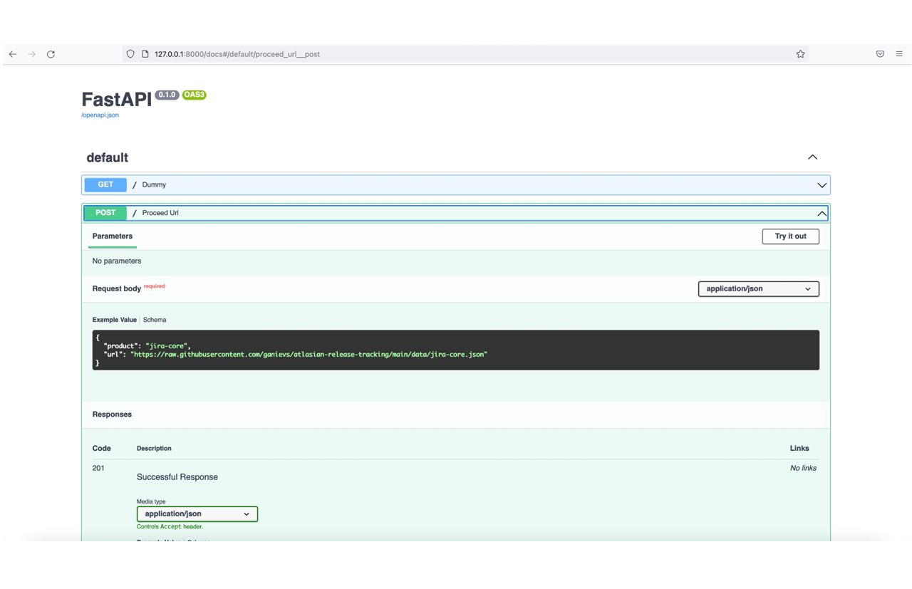

# Atlassian product updates tracking app

A simple app built with Fast API.

## Preconditions:
- Docker

## Build  
```sh
$ docker build -t atlasian-release-tracking .
```
## Run
```sh
$ docker run --rm -ti -v data:/data -p 8000:8000 atlasian-release-tracking
```
## Run tests
```sh
$ docker run --rm -ti -p 8000:8000 atlasian-release-tracking bash -c "alembic upgrade head && pytest tests/test.py"
```
## Example request
### From cli
```sh
$ curl -X POST http://127.0.0.1:8000/ \
   -H 'Content-Type: application/json' \
   -d '{"product":"jira-core","url":"https://raw.githubusercontent.com/ganievs/atlasian-release-tracking/main/data/jira-core.json"}'
```
### From swagger ui
http://127.0.0.1:8000/docs


